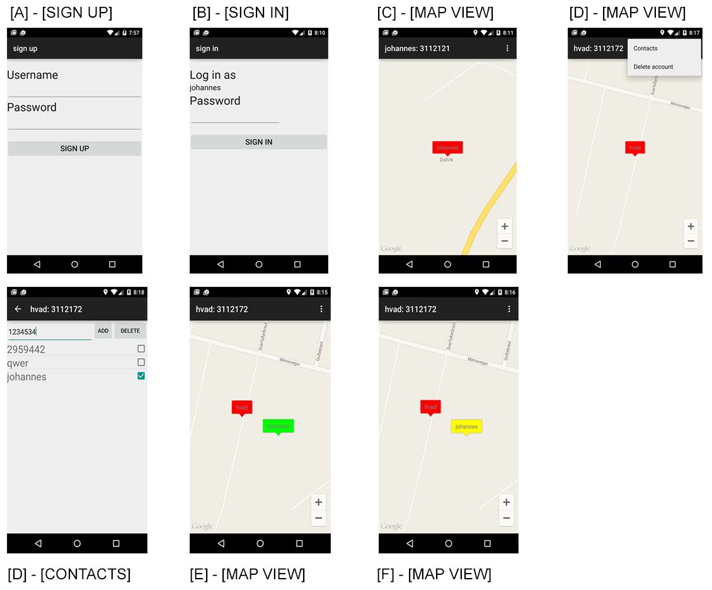
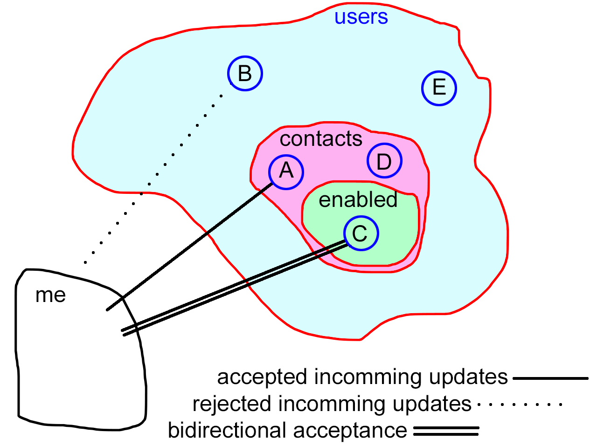

Design
======

Ripple consist of variations of four view:

* Sign up
* Sign in
* Map
* Contacts list

Underneath You see the different views and a few variations on the *Map* view.

At first I was experimenting with auto generated usernames to further obfuscate them as disposable and
give people the impression that they were *"non-personal"* but it was hard to implement the functionality of figuring
out which usernames were not taken at the BaaS so I went with people typing in usernames when signing up *(see Figure A)*

Markers
-------

Letting people customize their usernames also gave me the option to use these to personalize the map markers.
I decided to set the title of the container activity to a combination of username and user_id so it is easier
when you are adding contacts (you just look at their screen and type in their user_id and press add)

The map markers change color as a function of the time-since-last-ping.
In figure E and F you can see the functionality of the color change.
We see in figure E that user *"hvad"* has added and enabled the user *"johannes"*. Johannes is green because *"hvad"* has just
received a location update from *"johannes"*.

In figure F we see that *"johannes"* has stopped sending location updates to *"hvad"*, this has changed the color
of the *"johannes"* marker into yellow, the step between *"healthy"* and *"removed from map*".

Contacts
--------

Figure D shows the contacts view. This view is accessed from the action bar menu shown figure D.
The contacts view lets you add a new contact, presently by typing in the user id of the contact.
The view also lets you manage which contacts are enabled.

The contact list describes which users you accept location updates from, like a whitelist.
It also features a toggle switch to enable the contact.

Enabling a contact means that you add the contact to the subset of contacts you transmit your location to.

The figure beneath describes the relationships:

1 : accepted incoming updates:
    I accept, and draw markers for, incoming location updates from all contacts.
2 : rejected incoming updates:
    I reject and ignore incoming location updates from users not in contact sub-set.
3: bidirectional acceptance:
    The same as *1* with the added functionality that I actively transmit my location
    to users in this sub-sub-set at a fixed frequency.

