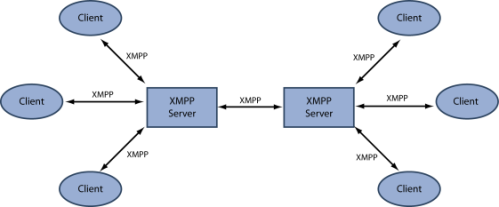

Process
=======

Overview
--------

I decided early on that I would make an Android App for location sharing.

I had been working with the version control system GIT before and decided to use it for this project.

   The figure above describes the amount of daily commits.

   The figure above shows the amount of daily additions/deletions, *(green/red)*, of lines.

Around start of April is a slow down of productivity, this is around the same period where I started researching
how to change the whole app from a focus on activities and onto fragments. It is also the same time where I had
to write a lot of deliverables to other classes I am attending.

I started by defining which subjects I would need to research in order to find the optimal solution before
starting to implement them.

My main concerns from the start was:

* How to easily get XMPP up and running, best scenario would be without running the server myself
* Do I need a BaaS?
* How do I make the application secure?
* Should I put most weight on activities or fragments?

XMPP and BAAS
-------------

I started by researching which solutions existed for messaging between users.
Originally I wanted my application to establish further security by having a decentralized protocol for
communications.

However I soon figured out that decentralized communication is *bleeding edge* and in general not widely implemented.
I dwelled at the extremely interesting *"Tele-Hash"* protocol by Jeremy Miller and wondered if I could
make my own java implementation within the time frame but decided it was unrealistic.
There is a short description of the Tele-Hash protocol in the appendices.

   The xmpp protocol: client to server, server to server
   [#xmpp_protocol]_

If it shouldn't be a decentralized protocol then the next best thing would be XMPP also originally invented by Jeremy Miller in the late 90's.

To create a XMPP system You need client implementations and a server.
I tried to use the most recently updated XMPP libs for android I could find, called *"Smack"*.
I setup an XMPP server on my home server and tried to connect to it. After 2 days of trial and error I still had not
established a connection.

When searching for a solution to one of the endless undocumented XMPP exceptions from the *smack* driver I came across
a reference to the Quickblox BaaS.

Quickblox used XMPP within but exposed a more simple XMPP API to the programmer.

I decided it was the way to go and a bonus was that Quickblox provided an XMPP service as well so I didn't have to run it myself.

Secutity and authentication
---------------------------

When I had decided on the Quickblox SDK I started looking for ways to implement security in the application.
Security is critical since people are sharing their location and if a phone is compromised I wanted to reduce the likelihood of
exposing all the locations of said phones contacts.

I had some ideas to implement security:

**Make accounts disposable and decoupled**
The idea is to let accounts in my system be as naked as possible and decouple them from peoples private
information, like facebook, phone, email etc.
In this way you obfuscate the user so that the context is implicit, thereby overcoming a phone getting stolen and an unwanted entity gaining access to the map view.
This entity will only be able to see where a number of usernames are located and nothing more.
This way the thief would need knowledge of the context of a user for the information to have any value.

**End to end encryption of all messages**
Early on I wanted the messages to furthermore be protected by encryption from end to end.
Different options exist for this and they all have their specialities.
I already knew about the PGP asymmetric encryption but it would break my idea of disposable accounts since pgp is
public/private key encryption and therefore a key pair would have to be generated and stored on each account creation.
This of course is no problem programmatically but if a solution existed providing end-to-end encryption without the keypairs I
would prefer this.

The solution seemed to be Off-The-Record encryption which was invented specifically for instant messaging.
The OTR protocol uses a combination of many *"crypto"* tricks to generate secure encryption per session and per message.

In this way I could make reasonably sure a message was not intercepted by a man-in-the-middle attack and the location of a user
could be exposed.

Sadly I came to this conclusion too late into the process and didn't have time to implement the OTR protocol.
However I managed to do the needed research and figure out which OTR library would have been suitable.

Activities and fragments
------------------------

Through the process I had implemented my app with a focus on activities, those being the first knowledge acquired from the lessons.
As I followed the Android lessons I was acquainted with the concept of fragments and how their life cycles are dramatically
different from that of activities.

I rewrote the whole program to use fragments and decided to use a Singleton for storing information between fragments.

.. rubric:: Footnotes

.. [#xmpp_protocol] http://www.isode.com/whitepapers/xmpp.html

.. raw:: pdf

   PageBreak