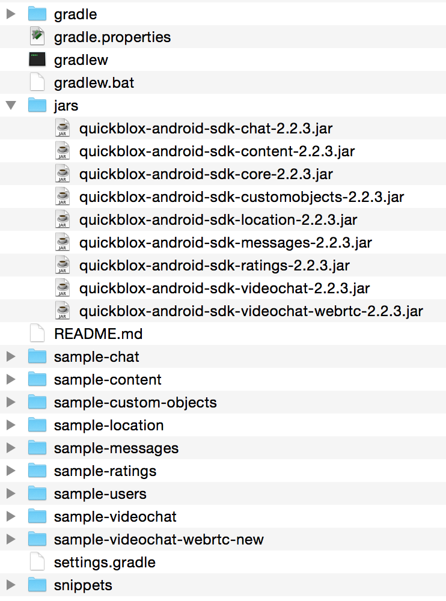

Theory
======

Quickblox is a powerful BaaS with SDK's for many different platforms focusing on providing easy
communication such as push notifications, chat messaging, and easy user account management.
Quickblox is a commercial BaaS with a free edition maxing out at 20 messages/second and 200000 monthly users.
These features make it a good choice for a student project.

Quickblox creates a nice streamlined for android that hides away a lot of the complexity of the underlying
libraries.

An example is that Quickblox uses XMPP for its chat protocol and uses the *smack* Android XMPP library but
Quickblox adds a level of abstraction by hiding all *smack* functions and leaving a cleaner, more high level API
for chat messaging.

In this section i will try to explain the Quickblox SDK concerning the User and Chat parts. I will provide
an implementation skeleton and a guide on how to install the library.

The Android SDK for Quickblox in general presents you with a callback-based asynchronous package of functions.
An example for what this means is that if You want to login, You create a login *try* and a callback if login was successful.
#TODO - explain why this is different - normal synchronous behaviour - etc 
This relieves your own code from having to deal with blocking API calls. See implementation/user for an example.

This section is inspired by the useful documentation provided by Quickblox on their website [#quickblox_website]_

Installation
-------------

You download the Quickblox Android SDK from their website [#quickblox_website]_ as a zip with examples included.
Below you can see how the downloaded sdk is organized:

The jars directory contains all the jars of the SDK; You choose which jars to embed in your project according to the parts 
of the Quickblox functionality you want.

You can always take a look in the different sample projects if you are uncertain which jars are needed for a certain part
of the api.

Setup example
-------------

You need to tell Cradle to include the quickblox jars when building.

As an example i want to use the Users and Chat API's form the Quickblox SDK. 
The User API provides user authentication as well as means to letting users manage their user profiles.
The Chat API provides user to user chat an the ability to check if another user is online.

For this example you would need the following jars:
(i replaced the version with VERSION)

* quickblox-android-sdk-core_VERSION.jar
* quickblox-android-sdk-chat-VERSION.jar

The *core* jar contains all the core functionality of Quickblox, for example the User api.
The *chat* jar contains all functions related to chat messaging.

You use the following syntax in your cradle settings

.. code-block:: java

   dependencies {
      compile files('libs/quickblox-android-sdk-core-2.1.jar')
      compile files('libs/quickblox-android-sdk-chat-2.1.jar')
   }

And remember to define permissions for internet access in your manifest:

.. code-block:: xml

   <uses-permission android:name="android.permission.INTERNET" />

Implementation examples
-----------------------

User
''''

To use the Users API you need to start by creating a session.

Session
,,,,,,,

Quickblox provides a nice *createSession* function that takes a callback as a parameter.
Therefore you don't have to worry about the main thread being blocked while creating the session!

.. code-block:: java

   QBAuth.createSession(new QBEntityCallbackImpl<QBSession>() {

       @Override
       public void onSuccess(QBSession session, Bundle params) {
           /*
           YEAH you created your first Quickblox session!
           now go and have some Quickblox fun
           */
       }

       @Override
       public void onError(List<String> errors) {
           /*
           Too bad, there was an error establishing contact to the API server
           have a look in the error list for an explanation!
           */
       }
   });

The Quickblox API expects You to implement some kind of state machine where each callback places you in a corresponding state.
The createSession callback should lead either to a *session success* or *connection error* state.

Sign up
,,,,,,,

If you are in the *session success* state you are able to do API calls to Quickblox. Let's start by creating a user:

Let's create a user with the following information:

* username = karlmarx
* password = kapital
* phone number = 11223344

.. code-block:: java

   final QBUser user = new QBUser("karlmarx", "kapital");
   user.setPhone("11223344")

   QBUsers.signUp(user, new QBEntityCallbackImpl<QBUser>() {
       @Override
       public void onSuccess(QBUser user, Bundle args) {
           /*
           YEAH! you chose a unique, unused username and the API
           successfully created a new user
           */
       }

       @Override
       public void onError(List<String> errors) {
           /*
           Too bad, your new account was not accepted,
           there can be any number of reasons, have a look in the errors list ;-)
           */
       }
   });

A Quickblox *user* can have many more fields set on it self both at creation and later on.
These fields include:

* facebook id
* twitter id
* email
* tags (as a list of strings)
* website url

Sign in
,,,,,,,

When You have successfully signed up, You are allowed to sign in using the created user.
You can sign in using any number of ways ranging from Twitter/Facebook tokens to using the native Quickblox users API.

Continuing on our example I will describe the process of logging in with a username and a password.

.. code-block:: java

   QBUser user = new QBUser("karlmarx", "kapital")

   QBUsers.signIn(user, new QBEntityCallbackImpl<QBUser>() {
       @Override
       public void onSuccess(QBUser user, Bundle params) {
           /*
           Yeah you succesfully logged in!
           */
       }

       @Override
       public void onError(List<String> errors) {
           /*
           Too bad, Your credentials were rejected 
           look in the errors list for forensics ;-)
           */
       }
   });

This concludes the section on how to establish a Quickblox session, next up is sending a *hello world* chat message.

Chat
''''

This section takes for granted that you have an authenticated session established.
To begin chatting you need to establish some formalia beforehand.
These formalia include the ones required by the xmpp protocol. More specifically you need to tell the
xmpp protocol which frequency it will send an *"im online"* presence notification to keep you regarded as online.
This notification is part of the xmpp protocol and is not a traditional *"push notification"*.

You do it like this:

.. code-block:: java

   if (!QBChatService.isInitialized()) {
       QBChatService.init(context);
   }
   QBChatService.getInstance().startAutoSendPresence(60);

Here we initialize the chat service if its not already initialized and then start transmitting presence notifications to Quickblox.
If you want to handle changes in the connection you have to implement the *"ConnectionListener*" interface.

Chat "hello world"
,,,,,,,,,,,,,,,,,,

Quickblox provides two ways to implement chat, 1-1 and group chat.
I will describe 1-1 chat since it does not depend on a *group room* to exist beforehand.

To start a chat with another user you need to know the id of the user.
If you don't know the id of the user, You can get it by using another known field of the user.

Here is an example of how to aqcuire the id of a user with username *"karlmarx"*:

.. code-block:: java

   QBUsers.getUserByLogin("karlmarx", new QBEntityCallbackImpl<QBUser>() {
       @Override
       public void onSuccess(QBUser user, Bundle args) {
           int user_id_of_karl_marx = user.getId()
       }

       @Override
       public void onError(List<String> errors) {
           /*
           Too bad you have not supplied right info, check errors list for explanations!
           */
       }
   });

When you have the id of the user, You proceed to creating a chat with this user through the following steps:

**Define a QBMessageListener of type QBPrivateChat** 

.. code-block:: java

   QBMessageListener<QBPrivateChat> privateChatMessageListener = new QBMessageListener<QBPrivateChat>() {
       @Override
       public void processMessage(QBPrivateChat privateChat, final QBChatMessage chatMessage) {

       }

       @Override
       public void processError(QBPrivateChat privateChat, QBChatException error, QBChatMessage originMessage){

       }

       @Override
       public void processMessageDelivered(QBPrivateChat privateChat, String messageID){

       }

       @Override
       public void processMessageRead(QBPrivateChat privateChat, String messageID){
       }
   };

**Define a QBPrivateChatManagerListener**

.. code-block:: java

   QBPrivateChatManagerListener privateChatManagerListener = new QBPrivateChatManagerListener() {
       @Override
       public void chatCreated(final QBPrivateChat privateChat, final boolean createdLocally) {
           if(!createdLocally){
               privateChat.addMessageListener(privateChatMessageListener);
           }
       }
   };

**Add the QBPrivateChatManagerListener to the QBChatService**

.. code-block:: java

   QBChatService.getInstance().getPrivateChatManager().addPrivateChatManagerListener(privateChatManagerListener);

**Create a QBChatMessage and send it**

.. code-block:: java

   Integer opponentId = user_id_of_karl_marx;

   try {
       QBChatMessage chatMessage = new QBChatMessage();
       chatMessage.setBody("Hello world");

       privateChat = privateChatManager.createChat(opponentId, privateChatMessageListener);
       privateChat.sendMessage(chatMessage);
   } catch (XMPPException e) {

   } catch (SmackException.NotConnectedException e) {

   }

The exceptions can be quite non descriptive since they often refer to functions from inside the SDK jars.

This concludes the theory on the Quickblox android SDK

.. rubric:: Footnotes

.. [#quickblox_website] http://quickblox.com/developers/Android#Download_Android_SDK.

.. raw:: pdf

   PageBreak

